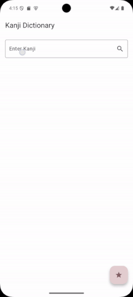

# Итоговый проект

БПМ-22-ПО-1, Лебкова Марина

## Описание
Приложение-словарь, позволяющее пользователю искать иероглифы (Кандзи),
сохранять их в Избранное и просматривать его.

## Демонстрация работы


## Детали реализации

### Архитектура
- **Слой представления (presentation)** содержит:
  - виджет карточки иероглифа,
  - домашний экран с поиском и экран сохранённых иероглифов,
  - провайдер для доступа к данным и управления состоянием
- **Слой домена (domain)** содержит:
  - сущность Кандзи,
  - репозиторий (юзкейс) для доступа к данным (поиск)
- **Слой данных (data)** содержит:
  - реализацию репозитория,
  - источники данных - из API и локального хранилища
  - KanjiDTO - модель данных иероглифа из API

### Стейт-менеджмент
- Для управления состоянием используется `Provider`

### Источники данных
- API: [Kanji API](https://kanjiapi.dev/)
  - для корректной работы необходим файл `.env`:
```
KANJI_API_URL=https://kanjiapi.dev/v1
```
- Локальное хранилище для сохранённых Кандзи: `SharedPreferences`

### Основные виджеты
- `MaterialApp` - Контейнер для приложения, интерфейс с использованием Material Design
- `Scaffold` - Базовая структура экрана, включает `AppBar` и `body`
- `TextField` - Поле для ввода иероглифа в поиск
- `ListView` - Виджет для отображения списка иероглифов
- `SingleChildScrollView` - Виджет для прокрутки главного экрана и списка иероглифов
- `Consumer` - Виджет для отслеживания изменений в `KanjiProvider`
- `KanjiWidget` - Виджет карточки иероглифа
