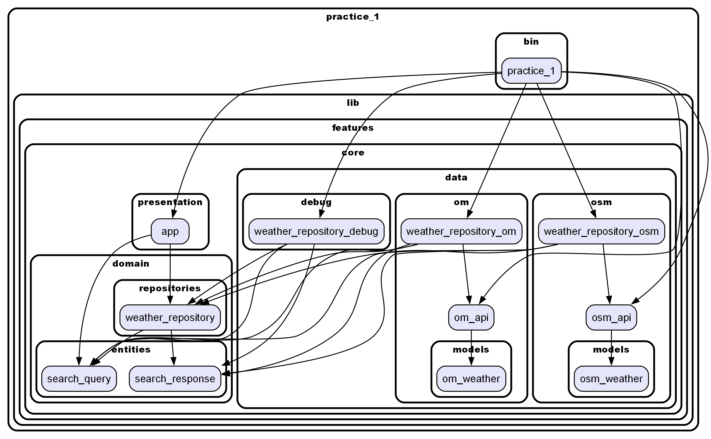

# Домашнее задание №1
## БПМ-22-ПО-1, Лебкова Марина

Реализован новый repository для API [Open Meteo](https://open-meteo.com/en/docs#current=temperature_2m,weather_code&hourly=&daily=).
Ключ не требуется.

[OpenWeather](https://openweathermap.org/current):
- получение погоды по названию города на английском
- получение погоды по долготе и широте

Open Meteo:
- получение погоды по долготе и широте

Граф зависимостей:

