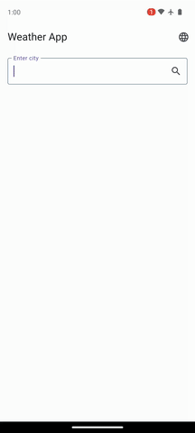
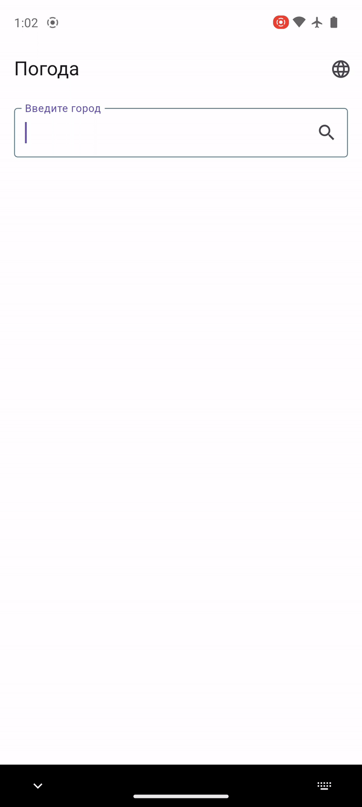

# Домашнее задание №3
### БПМ-22-ПО-1, Лебкова Марина

### Описание задания
Разработано простое мобильное приложение на Flutter, 
которое позволяет пользователю вводить название города и 
получать информацию о погоде в этом городе. Использует
доработанное API OpenMeteo из первой практики.

При вводе названия города посылается запрос GeoCoding OpenMeteo
для получения координат и затем возвращается погода по этим координатам.

Интерфейс приложения поддерживает русский и английский языки.

### Основные виджеты

- `MaterialApp` - Контейнер для приложения, интерфейс с использованием Material Design.

- `Scaffold` - Базовая структура экрана: включает `AppBar`, `body` и задаёт общий фон через `backgroundColor`.

- `TextField` - Поле ввода для поиска города с иконкой поиска, валидацией ввода и изменением состояния при ошибках.

- `IconButton` - Кнопка с иконкой для выполнения действия (поиск и смена языка). 

- `Expanded` - Виджет, который занимает всё доступное пространство, 
- используется для центровки и масштабирования содержимого.

- `Container` - Используется для стилизации виджетов в отображении погоды.

- `Column`, `Row` - Организация виджетов вертикально или горизонтально соответственно.

- `CircularProgressIndicator` - Анимация загрузки, отображается при ожидании данных.

- `Text` - Для отображения текста (например, температуры, состояния погоды, ошибок).

- `Icon` - Для отображения иконок погоды и других элементов интерфейса.

### Обработка ошибок
- Если город не найден, под полем ввода отображается сообщение об ошибке
`errorMessage`, флаг `_isError` становится `True`
- Изменяется цвет рамки на красный
- Вызывается метод `clearWeather()` для очистки текущих данных о погоде

### API
Для работы приложения необходим файл `.env`, в котором указаны необходимые URL:
```
OM_API_URL=https://api.open-meteo.com/
GEO_OM_API_URL=https://geocoding-api.open-meteo.com/
```
Ключ не требуется.

### Демонстрация работы приложения


