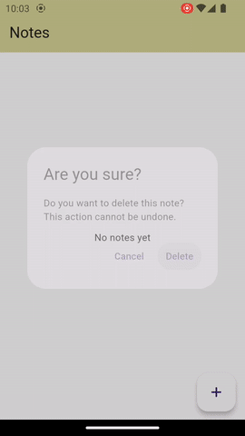

# Практическое задание №4

### БПМ-22-ПО-1, Лебкова Марина

### Описание задания
Приложение позволяет пользователю создавать, 
просматривать, редактировать и удалять заметки.
Для управления состоянием используется **BLoC** (для простоты **Cubit**).

### Основные виджеты
- `MaterialApp` - Контейнер для приложения, интерфейс с использованием Material Design.

- `Scaffold` - Базовая структура экрана, включает `AppBar` и `body`.

- `TextField` - Поле для ввода текста и названия заметки.

- `AlertDialog` и `showDialog` - Диалоговое окно для подтверждения удаления.

### Демонстрация работы приложения
